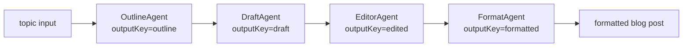

The previous round left the demo with two open ideas in its "Future Experiments" list: **chain of agents** (sequential prompt chaining) and **streaming function calling** (which shipped alongside the crew). Everything before this ran agents either through a single AI service call or through a supervisor that routes to one worker at a time. This round fills the gap: a deterministic, ordered pipeline where each stage feeds its output into the next via a shared `AgenticScope`.

## What Is a Chain of Agents?

LangChain4j's `AgenticServices.sequenceBuilder()` creates an `UntypedAgent` from a list of sub-agents that execute in order. Each sub-agent reads its input from the shared scope, writes its result to a named key, and the next agent picks up where the last one left off. There is no routing decision, no supervisor choosing which worker to call — it is a fixed, linear pipeline.

This is useful when the stages are known in advance and each one depends on the previous stage's output. The demo uses a blog-post generation pipeline:

1.  **OutlineAgent** — takes a topic, produces a structured outline (`outputKey = "outline"`)
    
2.  **DraftAgent** — takes the outline, writes a full draft (`outputKey = "draft"`)
    
3.  **EditorAgent** — takes the draft, edits for clarity and flow (`outputKey = "edited"`)
    
4.  **FormatAgent** — takes the edited text, formats into a publish-ready Markdown post (`outputKey = "formatted"`)
    



## The Code

Each sub-agent is a plain Java interface with `@SystemMessage`, `@UserMessage`, and `@Agent(outputKey = "...")`:

```java
@SystemMessage("You are a blog post outline specialist. Create a clear, structured outline "
        + "with a title, introduction, 3-5 main sections, and a conclusion.")
@UserMessage("Create a blog post outline for the following topic.\nTopic: {{topic}}")
public interface OutlineAgent {
    @Agent(outputKey = "outline", description = "Creates a structured blog post outline")
    String createOutline(@V("topic") String topic);
}
```

`DraftAgent`, `EditorAgent`, and `FormatAgent` follow the same pattern, each with its own `outputKey` and system message tailored to its role.

The pipeline is assembled in `ChainOfAgentsService`:

```java
OutlineAgent outlineAgent = AgenticServices.agentBuilder(OutlineAgent.class)
        .chatModel(chatModel).build();
DraftAgent draftAgent = AgenticServices.agentBuilder(DraftAgent.class)
        .chatModel(chatModel).build();
EditorAgent editorAgent = AgenticServices.agentBuilder(EditorAgent.class)
        .chatModel(chatModel).build();
FormatAgent formatAgent = AgenticServices.agentBuilder(FormatAgent.class)
        .chatModel(chatModel).build();

this.pipeline = AgenticServices.sequenceBuilder()
        .subAgents(outlineAgent, draftAgent, editorAgent, formatAgent)
        .outputKey("formatted")
        .build();
```

Two details:

*   **Each sub-agent is built independently** with its own `AgenticServices.agentBuilder()` call, then composed via `sequenceBuilder()`. This is different from the crew, where the supervisor and sub-agents are built together.
    
*   `outputKey("formatted")` tells the pipeline which scope key becomes the top-level return value of `pipeline.invoke()`.
    

To get the full trace (all intermediate outputs), use `invokeWithAgenticScope()`:

```java
ResultWithAgenticScope<String> result =
        pipeline.invokeWithAgenticScope(Map.of("topic", topic));
String formatted = result.result();
String outline = result.agenticScope().readState("outline", (String) null);
String draft = result.agenticScope().readState("draft", (String) null);
```

The REST endpoint (`POST /api/chain`) and CLI command (`/chain <topic>`) both return the full trace, not just the final output.

## Gotchas

Three things tripped us up during implementation:

1.  `@SystemMessage` **and** `@UserMessage` **go on the method, not the interface.** Placing them at the interface level produces a compile error: `annotation interface not applicable to this kind of declaration`. This is the same rule as for crew sub-agents, but it is easy to forget when the interface has only one method.
    
2.  `UntypedAgent.invoke()` **returns** `Object`**, not** `Map<String, Object>`**.** The return value is the value of the configured `outputKey`, not the full scope map. To access intermediate outputs, you must use `invokeWithAgenticScope()` and `agenticScope().readState(key)`.
    
3.  **Scope keys must be unique across all sub-agents.** Each agent's `outputKey` writes to a different key in the shared scope. If two agents share a key, the second one silently overwrites the first.
    

## Testing

The `ChainOfAgentsServiceTest` uses a `ScriptedSequenceChatModel` — a fake `ChatModel` that returns canned responses in order, one per agent invocation. This makes the test fully offline with no API calls:

```java
ScriptedSequenceChatModel chatModel = new ScriptedSequenceChatModel(
        List.of(OUTLINE, DRAFT, EDITED, FORMATTED));
ChainOfAgentsService service = new ChainOfAgentsService(chatModel);

ChainPipelineResult result = service.runWithTrace("Test Topic");

assertThat(result.outline()).isEqualTo(OUTLINE);
assertThat(result.draft()).isEqualTo(DRAFT);
assertThat(result.edited()).isEqualTo(EDITED);
assertThat(result.formatted()).isEqualTo(FORMATTED);
```

## What We Learned

The `sequenceBuilder()` fills a real gap between "one agent, one call" and "supervisor with routing." When the pipeline is fixed — outline, draft, edit, format — there is no need for a supervisor to decide which agent runs next. The shared `AgenticScope` is the glue: each agent writes its result, the next agent reads it, and the final `outputKey` gives you the finished product.

This also reinforces the value of the `ModelRegistry` abstraction. Every agent in the chain shares the same `ChatModel` bean, so switching providers at runtime switches the entire pipeline in one move. The registry keeps paying for itself.

* * *

**Next up:** The demo now has a supervisor-based crew (parallel delegation) and a chain-of-agents pipeline (sequential delegation). The remaining open idea is **parallel agent execution** — running multiple agents concurrently and merging their results.