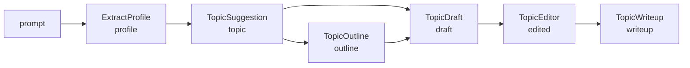

The previous round added two orchestration patterns: a supervisor-based crew (parallel delegation) and a chain-of-agents pipeline (sequential delegation). Both require you to know the execution order in advance. This round fills the gap with a **goal-oriented agent graph** — a pattern where typed sub-agents declare their required inputs and produced outputs, and a planner computes the shortest execution path automatically.

## What Is GOAP?

GOAP stands for **Goal-Oriented Action Planning**. In LangChain4j, the `GoalOrientedPlanner` (from the `langchain4j-agentic-patterns` module) analyzes the dependency graph of your agents and uses A\* search to find the shortest path from the current scope state to the goal.

Each agent declares:

*   **Preconditions** — what it needs from the scope (via `@V("key")` parameters)
    
*   **Postconditions** — what it writes to the scope (via `.outputKey()`)
    

The planner builds a directed graph from these declarations, then finds the shortest path that satisfies all dependencies. No LLM call is needed for planning — it's pure graph search.

## The Pipeline

The demo uses a personalized blog post generation pipeline with six agents:

| Agent | Reads (preconditions) | Writes (postcondition) |
| --- | --- | --- |
| `ExtractProfileAgent` | `prompt` | `profile` |
| `TopicSuggestionAgent` | `profile` | `topic` |
| `TopicOutlineAgent` | `topic` | `outline` |
| `TopicDraftAgent` | `topic`, `outline` | `draft` |
| `TopicEditorAgent` | `draft` | `edited` |
| `TopicWriteupAgent` | `profile`, `topic`, `outline`, `edited` | `writeup` |

The goal is `writeup`. Given an initial scope containing `prompt`, the planner computes the shortest path:

```plaintext
prompt → profile → topic → outline → draft → edited → writeup
```



## The Code

Each agent is a plain Java interface:

```java
@SystemMessage("You are a profile extractor...")
@UserMessage("Extract a short profile from the following prompt...{{prompt}}")
public interface ExtractProfileAgent {
    @Agent(outputKey = "profile", description = "Extracts a user profile from a prompt")
    String extractProfile(@V("prompt") String prompt);
}
```

The `TopicWriteupAgent` reads four scope keys and writes the final output:

```java
@SystemMessage("You are a blog post formatter...")
@UserMessage("""
        Create a personalized blog post using the following:
        - User profile: {{profile}}
        - Topic: {{topic}}
        - Outline: {{outline}}
        - Edited content: {{edited}}
        """)
public interface TopicWriteupAgent {
    @Agent(outputKey = "writeup", description = "Formats a personalized blog post")
    String createWriteup(@V("profile") String profile,
                         @V("topic") String topic,
                         @V("outline") String outline,
                         @V("edited") String edited);
}
```

The pipeline is assembled in `GraphOfAgentsService`:

```java
this.pipeline = AgenticServices.plannerBuilder()
        .subAgents(extractProfile, topicSuggestion, outline, draft, editor, writeup)
        .outputKey("writeup")
        .planner(GoalOrientedPlanner::new)
        .build();
```

That's it. The planner does the rest.

## How the Planner Works

When `pipeline.invoke(Map.of("prompt", "..."))` is called:

1.  **Graph construction.** The `GoalOrientedSearchGraph` iterates all sub-agents, extracts their `@V` parameter names (preconditions) and `.outputKey()` values (postconditions), and builds a directed graph.
    
2.  **Path search.** The `DependencyGraphSearch` (A\* algorithm) starts from the initial scope state (`{prompt}`) and finds the shortest path to the goal node (`writeup`).
    
3.  **Execution.** The planner invokes each agent in the computed order, writing results to the scope as it goes. Each agent's `@V` parameters are automatically populated from the scope.
    
4.  **Result.** The final output is the value of the goal key (`writeup`) from the scope.
    

The key insight: **the planner is algorithmic, not LLM-driven.** No LLM call is needed to decide which agent runs next. The graph search is deterministic and fast.

## Gotchas

Three things worth noting:

1.  `langchain4j-agentic-patterns` **is a separate module.** It has its own `-betaNN` version and must be added to `pom.xml` alongside `langchain4j-agentic`. The GOAP classes live in `dev.langchain4j.agentic.patterns.goap`.
    
2.  `plannerBuilder()` **has no** `chatModel()` **method.** The `chatModel` is set on each individual agent builder, not on the planner builder. The planner is purely an orchestration layer — it doesn't invoke any LLM itself.
    
3.  **Adding a new agent is declarative.** Just add a new interface with `@V` parameters and `outputKey`, build it with `agentBuilder()`, and add it to the `plannerBuilder().subAgents(...)` list. The planner automatically discovers its dependencies and recalculates the path.
    

## What We Learned

The GOAP pattern completes the orchestration trilogy: crew (supervisor delegation), chain (sequential pipeline), and graph (goal-oriented planning). The key difference is that the graph pattern doesn't require you to specify the execution order — you just declare what each agent needs and produces, and the planner figures out the rest.

This is powerful when the pipeline might vary depending on what's already available. If the initial scope already contains a `topic`, the planner automatically skips `ExtractProfileAgent` and `TopicSuggestionAgent`. The same agents work regardless of which scope keys are pre-populated.

The `langchain4j-agentic-patterns` module also includes BDI, Blackboard, Debate, P2P, and Voting patterns — all built on the same `Planner` abstraction. Each pattern is composable: a GOAP sub-graph can wrap a loop, a conditional, or a parallel workflow as one of its agents.

* * *

**Next up:** The demo now has all three core orchestration patterns. The remaining open idea is **parallel agent execution** — running multiple agents concurrently and merging their results.