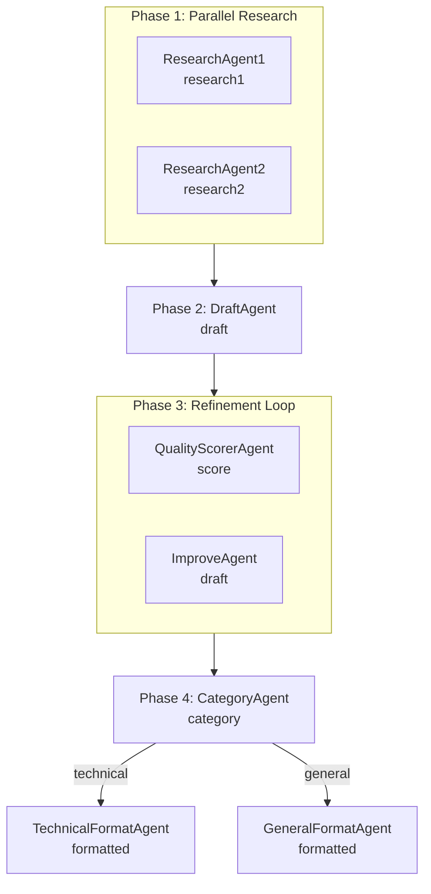

The orchestration trilogy is complete. After sequential chaining (#227) and goal-oriented graph planning (#228), this round adds the third pattern: **workflow composition** — building complex pipelines from parallel, loop, and conditional primitives.

## The Three Building Blocks

LangChain4j's `agentic` module provides three workflow patterns that can be nested inside each other:

### Parallel (`parallelBuilder`)

Runs sub-agents concurrently, then merges results via an `output()` function:

```java
UntypedAgent parallelResearch = AgenticServices.<String>parallelBuilder()
        .subAgents(researchAgent1, researchAgent2)
        .outputKey("research")
        .output(scope -> {
            String r1 = scope.readState("research1", "");
            String r2 = scope.readState("research2", "");
            return r1 + "\n\n" + r2;
        })
        .build();
```

### Loop (`loopBuilder`)

Runs sub-agents repeatedly until an exit condition is met:

```java
UntypedAgent refinementLoop = AgenticServices.<String>loopBuilder()
        .subAgents(qualityScorer, improveAgent)
        .maxIterations(3)
        .exitCondition(scope -> scope.readState("score", 0.0) >= 0.8)
        .build();
```

### Conditional (`conditionalBuilder`)

Routes to different sub-agents based on a predicate:

```java
UntypedAgent conditionalFormatter = AgenticServices.<String>conditionalBuilder()
        .subAgents(
                scope -> "technical".equals(scope.readState("category", "")),
                technicalFormat)
        .subAgents(
                scope -> !"technical".equals(scope.readState("category", "")),
                generalFormat)
        .build();
```

## The Demo Pipeline

The workflow generates a blog post with four phases:



| Agent | Reads | Writes | Pattern |
| --- | --- | --- | --- |
| `ResearchAgent1` | `topic` | `research1` | parallel |
| `ResearchAgent2` | `topic` | `research2` | parallel |
| `WorkflowDraftAgent` | `topic`, `research1`, `research2` | `draft` | sequential |
| `QualityScorerAgent` | `draft` | `score` | loop |
| `ImproveAgent` | `draft` | `draft` | loop |
| `CategoryAgent` | `topic` | `category` | sequential |
| `TechnicalFormatAgent` | `draft` | `formatted` | conditional |
| `GeneralFormatAgent` | `draft` | `formatted` | conditional |

All four patterns compose in a single sequence:

```java
this.pipeline = AgenticServices.sequenceBuilder()
        .subAgents(parallelResearch, draftAgent, refinementLoop, categoryAgent)
        .subAgents(conditionalFormatter)
        .outputKey("formatted")
        .build();
```

## Gotchas

Three things worth noting:

1.  **Builders must call** `.build()`**.** `parallelBuilder()`, `loopBuilder()`, and `conditionalBuilder()` return builder objects. You must call `.build()` to get the `UntypedAgent` that can be passed to `sequenceBuilder().subAgents()`. Forgetting `.build()` causes a cryptic "No agent method found" error.
    
2.  **Parallel output() merges scope keys.** The `output()` function on `parallelBuilder` reads sub-agent outputs from the scope and combines them. Set `outputKey()` to write the merged result back to the scope.
    
3.  **Loop exitCondition is checked after each iteration.** The predicate receives the live `AgenticScope`. The loop runs sub-agents sequentially within each iteration — so if you have `[scorer, improver]`, iteration 1 runs scorer then improver, and iteration 2 runs scorer again (checking the exit condition).
    

## What We Learned

The three workflow patterns cover the common orchestration cases:

*   **Parallel** for independent work that can run concurrently (research, brainstorming)
    
*   **Loop** for iterative refinement (quality scoring, style review)
    
*   **Conditional** for branching logic (formatting, routing)
    
*   **Sequence** for chaining them together
    

The key insight is that all three are composable. A loop can wrap a parallel workflow. A conditional can branch to a parallel or loop sub-graph. The `sequenceBuilder` orchestrates them in order.

This completes the orchestration feature set for the demo: crew (supervisor delegation), chain (sequential pipeline), graph (GOAP planning), and workflow (parallel/loop/conditional composition).

* * *

**Next up:** The demo now covers all core orchestration patterns. The remaining open idea is **parallel agent execution** — running multiple agents concurrently and merging their results, which is partially covered by the parallel pattern here.